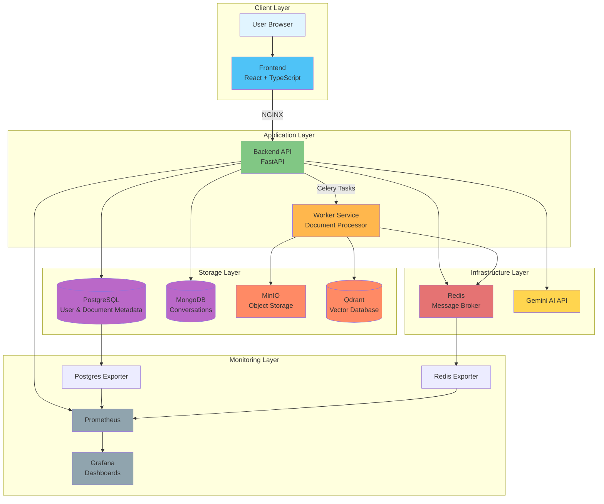
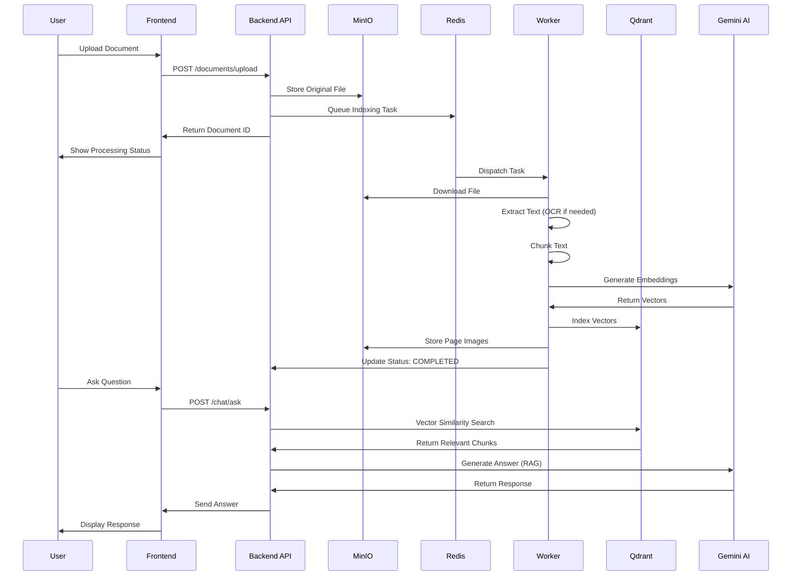
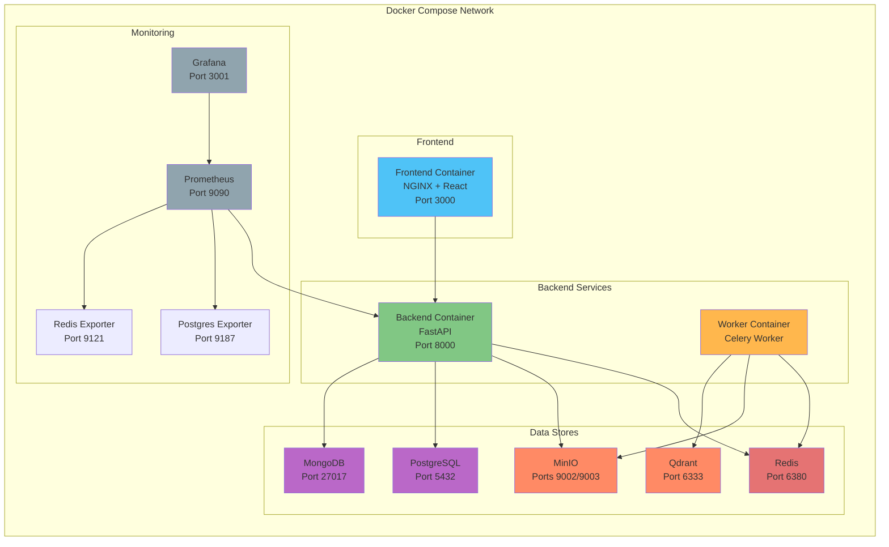
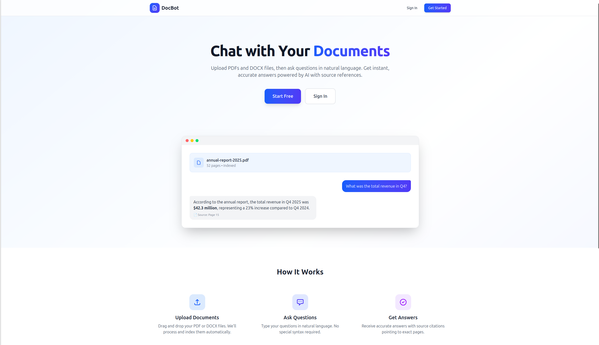
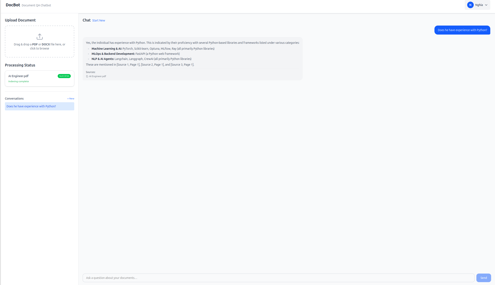

# DocBot - AI-Powered Document QA Chatbot

<div align="center">

**An intelligent document question-answering system powered by Google Gemini AI**

[](https://opensource.org/licenses/MIT)
[](https://www.docker.com/)
[](https://fastapi.tiangolo.com/)
[](https://reactjs.org/)

</div>

---

## Overview

DocBot is a comprehensive document-based question-answering chatbot system that enables users to upload documents and ask questions about their content. The system leverages Google's Gemini AI model for natural language understanding and generation, combined with a powerful vector search engine for accurate context retrieval.

### Key Capabilities

- **Multi-format Support**: Process PDF, DOCX, and scanned PDFs with OCR
- **Intelligent RAG**: Retrieval-Augmented Generation for accurate, context-aware answers
- **Conversational Memory**: Maintains chat history for contextual conversations
- **Real-time Processing**: Asynchronous document processing with progress tracking
- **Production-Ready**: Complete monitoring, logging, and containerized deployment

---

## Features

### Document Processing
- Upload PDF and DOCX documents
- OCR support for scanned PDFs using PaddleOCR
- Automatic text extraction and chunking
- Intelligent document preprocessing

### AI-Powered QA
- Natural language question answering
- Context-aware responses using RAG (Retrieval-Augmented Generation)
- Powered by Google Gemini AI models
- Vector similarity search for relevant content retrieval

### User Experience
- Modern, responsive web interface
- Drag-and-drop file upload
- Real-time processing status updates
- Conversation history management
- User authentication and authorization

### Infrastructure
- Microservices architecture
- Horizontal scalability
- Asynchronous task processing with Celery
- Prometheus + Grafana monitoring
- Database health checks and exporters

---

## System Architecture

### High-Level Architecture

The DocBot system consists of multiple interconnected components working together to provide intelligent document QA capabilities:

**Architecture Components:**
- **Client Layer**: Web browser interface with React/TypeScript frontend
- **Application Layer**: FastAPI backend and Celery worker for document processing
- **Storage Layer**: PostgreSQL (metadata), MongoDB (conversations), MinIO (files), Qdrant (vectors)
- **Infrastructure**: Redis message broker, Gemini AI API
- **Monitoring**: Prometheus metrics collection and Grafana visualization

<details>
<summary>View Architecture Diagram (Mermaid)</summary>



*Note: To view Mermaid diagrams in VS Code, install the "Markdown Preview Mermaid Support" extension*

</details>

### Document Processing Flow

The system follows a comprehensive workflow for document processing and question answering:

1. **Upload Phase**: User uploads document → Backend stores in MinIO → Celery task queued
2. **Processing Phase**: Worker downloads file → Extracts text (with OCR if needed) → Chunks text → Generates embeddings via Gemini
3. **Indexing Phase**: Embeddings stored in Qdrant with metadata
4. **Query Phase**: User asks question → Vector similarity search → RAG with Gemini → Answer returned

<details>
<summary>View Processing Flow Diagram (Mermaid)</summary>



*Note: To view Mermaid diagrams in VS Code, install the "Markdown Preview Mermaid Support" extension*

</details>

### Deployment Architecture

All components are containerized and orchestrated using Docker Compose:

**Service Overview:**
- Frontend (Port 3000), Backend (Port 8000), Worker (background)
- Redis (6380), MinIO (9002/9003), Qdrant (6333)
- PostgreSQL (5432), MongoDB (27017)
- Prometheus (9090), Grafana (3001)
- Health checks and exporters for all critical services

<details>
<summary>View Deployment Diagram (Mermaid)</summary>



*Note: To view Mermaid diagrams in VS Code, install the "Markdown Preview Mermaid Support" extension*

</details>

---

## Technology Stack

### Frontend
- **React 18** - Modern UI library
- **TypeScript** - Type-safe JavaScript
- **Vite** - Fast build tool and dev server
- **NGINX** - Production web server

### Backend
- **FastAPI** - High-performance Python web framework
- **SQLAlchemy** - SQL ORM
- **Alembic** - Database migrations
- **Motor** - Async MongoDB driver
- **PyJWT** - JWT authentication

### Worker & AI
- **Celery** - Distributed task queue
- **Google Gemini AI** - Language model for embeddings and generation
- **PaddleOCR** - OCR for scanned documents
- **PyPDF2 / python-docx** - Document parsing

### Data Stores
- **PostgreSQL** - User and document metadata
- **MongoDB** - Conversation storage
- **Qdrant** - Vector database for embeddings
- **MinIO** - S3-compatible object storage
- **Redis** - Message broker and cache

### Monitoring & Operations
- **Prometheus** - Metrics collection
- **Grafana** - Metrics visualization
- **Docker Compose** - Container orchestration

---

## Screenshots

### Homepage - Upload Documents


The DocBot homepage features a clean, intuitive interface where users can:
- Drag and drop documents for upload
- View upload progress and processing status
- See a list of previously uploaded documents
- Track document indexing in real-time

### Chat Interface - Ask Questions


The chat interface provides:
- Conversational question-answering experience
- Context-aware responses based on uploaded documents
- Message history preservation
- Real-time typing indicators
- Source document references

---


### Accessing the Application

1. **Frontend**: Open [http://localhost:3000](http://localhost:3000)
2. **API Documentation**: Visit [http://localhost:8000/docs](http://localhost:8000/docs)
3. **Grafana Dashboard**: Go to [http://localhost:3001](http://localhost:3001) (admin/admin)
4. **MinIO Console**: Access [http://localhost:9003](http://localhost:9003) (minioadmin/minioadmin)

### Using the System

#### 1. Create an Account
- Register a new user account
- Log in with your credentials

#### 2. Upload Documents
- Click "Upload Document" or drag and drop files
- Supported formats: PDF, DOCX
- Wait for processing to complete

#### 3. Ask Questions
- Type your question in the chat input
- The system retrieves relevant context and generates answers
- View conversation history

#### 4. Manage Conversations
- Create new conversations
- Switch between conversations
- Delete old conversations

### Stopping the Application

```bash
# Stop services (preserve data)
./start.sh stop

# Stop and remove containers
./start.sh down

# Stop and clean all data (including volumes)
./start.sh clean
```

---

## Project Structure

```
DocBot/
├── backend/                    # FastAPI backend service
│   ├── alembic/               # Database migrations
│   ├── core/                  # Core utilities and clients
│   │   ├── celery_client.py
│   │   ├── config.py
│   │   ├── gemini_client.py
│   │   ├── minio_client.py
│   │   ├── mongodb.py
│   │   └── postgres.py
│   ├── models/                # SQLAlchemy models
│   ├── routers/               # API endpoints
│   │   ├── auth.py
│   │   ├── chat.py
│   │   ├── conversations.py
│   │   └── documents.py
│   ├── schemas/               # Pydantic schemas
│   ├── services/              # Business logic
│   ├── main.py               # Application entry point
│   └── requirements.txt
│
├── frontend/                  # React frontend application
│   ├── src/
│   │   ├── components/       # React components
│   │   ├── api.ts           # API client
│   │   ├── AuthContext.tsx  # Authentication context
│   │   └── types.ts         # TypeScript types
│   ├── nginx.conf           # NGINX configuration
│   └── package.json
│
├── worker/                    # Celery worker service
│   ├── core/                 # Worker core modules
│   │   ├── celery_app.py
│   │   ├── document_processor.py
│   │   ├── gemini_client.py
│   │   ├── paddleocr.py
│   │   └── qdrant_client.py
│   ├── tasks/                # Celery tasks
│   │   ├── index_task.py
│   │   └── search_task.py
│   └── requirements.txt
│
├── monitoring/               # Monitoring configuration
│   ├── grafana/
│   │   └── provisioning/
│   │       ├── dashboards/
│   │       └── datasources/
│   └── prometheus/
│       └── prometheus.yml
│
├── image/                    # Project screenshots
├── docker-compose.yml        # Docker orchestration
├── start.sh                  # Startup script
└── README.md                 # This file
```

---


## Monitoring

### Prometheus Metrics

Access Prometheus at [http://localhost:9090](http://localhost:9090)

Available metrics:
- Application-level metrics (request rate, latency)
- Database metrics (connections, query performance)
- Infrastructure metrics (CPU, memory, disk)

### Grafana Dashboards

Access Grafana at [http://localhost:3001](http://localhost:3001)

**Default Credentials**: admin / admin

Pre-configured dashboards:
- **DocBot Overview**: System-wide metrics
- **PostgreSQL**: Database performance
- **Redis**: Cache and broker metrics

---

## Development

### Running Backend Locally

```bash
cd backend
python -m venv venv
source venv/bin/activate  # On Windows: venv\Scripts\activate
pip install -r requirements.txt
uvicorn main:app --reload --port 8000
```

### Running Frontend Locally

```bash
cd frontend
npm install
npm run dev
```

### Running Worker Locally

```bash
cd worker
python -m venv venv
source venv/bin/activate
pip install -r requirements.txt
celery -A core.celery_app worker --loglevel=info
```

### Database Migrations

```bash
cd backend

# Create new migration
alembic revision --autogenerate -m "Description"

# Apply migrations
alembic upgrade head

# Rollback migration
alembic downgrade -1
```

---


<div align="center">

**Built with ❤️ using FastAPI, React, and Gemini AI**

⭐ Star this repository if you find it helpful!

</div>
